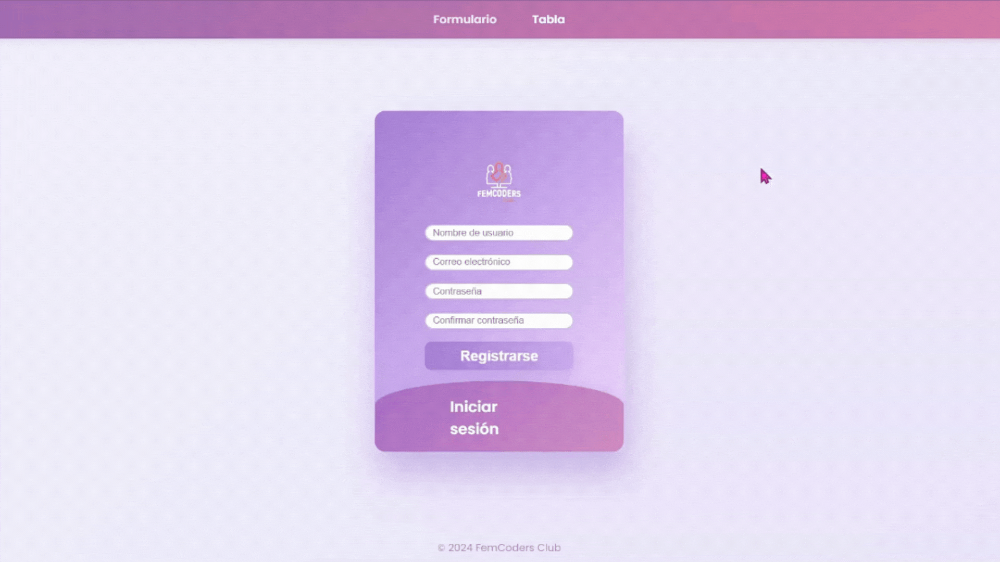
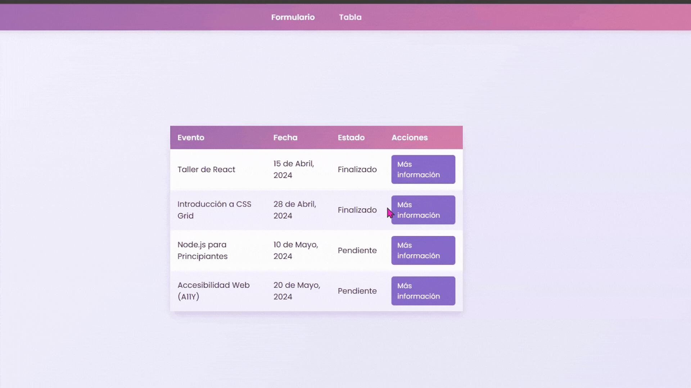

# 📘 Ejemplo Práctico de Formularios y Tablas con HTML y CSS

Este proyecto es un ejemplo práctico creado para acompañar nuestro post sobre [formularios y tablas en HTML](https://www.femcodersclub.com/recursos/html/formularios-y-tablas) en FemCoders Club. En este repositorio, mostramos cómo usar HTML y CSS para construir formularios y tablas dinámicas de una manera visual, práctica y accesible.

## Vista Previa

### Formulario de Registro e Inicio de Sesión



### Tabla de Eventos



## Descripción

El proyecto se divide en dos partes principales:

1. **Formulario**:
   - **Dinámico y Visual**: Este formulario es interactivo, cambiando entre dos vistas (iniciar sesión y registrarse) al hacer clic en el botón correspondiente.
   - **Validación con `required`**: Se ha utilizado el atributo `required` para asegurar que los campos esenciales estén completos antes de enviar el formulario.
   - **Diseño Intuitivo**: Todo está contenido en una estructura visualmente atractiva, permitiendo al usuario una experiencia práctica y amigable.
2. **Tabla de Eventos**:
   - **Datos Ficticios**: La tabla muestra datos de eventos de manera ficticia, solo para fines informativos y de práctica.
   - **Despliegue Dinámico de Información**: Usando las etiquetas HTML `<details>` y `<summary>`, los usuarios pueden expandir y colapsar la información adicional, como los nombres de los ponentes de cada evento. Esto ofrece una forma elegante y sin JavaScript de mostrar contenido adicional bajo demanda.

## 🛠️ Tecnologías Utilizadas

- **HTML** para la estructura.
- **CSS** para el diseño visual, con efectos modernos y fáciles de entender.

## Instalación y Uso

1. Clona el repositorio:
   ```bash
   git clone https://github.com/femcodersclub/Formularios-Tablas-HTML-CSS.git
   ```

2. Abre el archivo `index.html` en tu navegador para ver el formulario, o `tabla.html` para ver la tabla.

## Créditos

Todos los datos de este proyecto son ficticios y se usan únicamente con fines educativos y demostrativos. Este ejemplo es parte del contenido práctico de [FemCoders Club](https://www.femcodersclub.com/), una comunidad para mujeres en tecnología.
